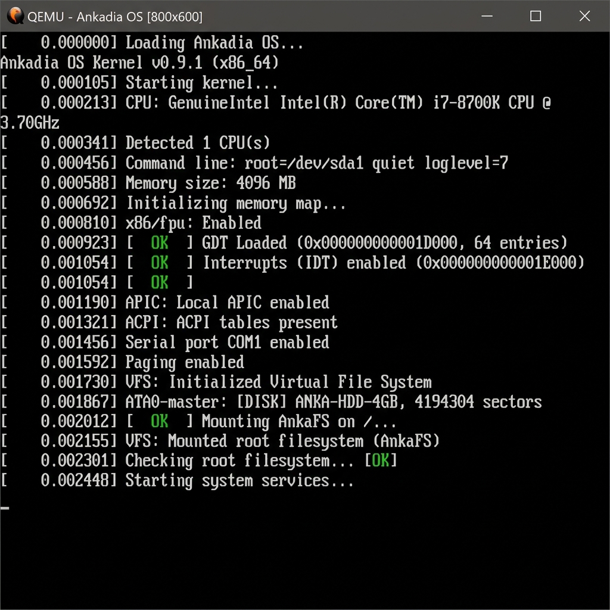

# Ankadia OS (Operating System)



Ankadia OS is an experimental x86 Micro-kernel Operating System specifically designed for the Turkish programming language "Ankadia". It features a Dark Purple theme and operates entirely isolated from the hardware.

## Project Goal
The goal of this project is to go beyond classic black-and-white or blue screens and create a unique ecosystem with a GUI structure that fully supports **Turkish characters**. The main objective is to move our Turkish IDE from being a desktop application to being directly integrated into the operating system itself.

## Folder Structure (V1.0.0)

- `/boot`: x86 Assembly stubs for GRUB Multi-boot specifications (Bootloader).
- `/kernel`: The main body written in C, setting up GDT (Global Descriptor Table), IDT, and Protected Mode components.
- `/drivers`: VGA display adapter modules for drawing pixels or text, and keyboard reading modules with Turkish character support (IRQ1 interrupt).
- `/gui`: Front-end components of the windowing system, using a "Double Buffering" architecture for drawing interfaces.
- `Makefile`: Build definitions to quickly compile the system and generate the `ankadiaos.iso` output.

## Requirements and Build Process (On Linux or WSL)

To compile this system from scratch, you need a GCC cross-compiler (`i686-elf-gcc`) on your machine and the nasm assembler for the Assembly parts.

To run the system using QEMU emulation, use the following command:

```bash
make
make run
```

If you want to create an ISO to open with VirtualBox or VMware:
```bash
make iso
```

*(Note: Boot_Ekrani.png and Arayuz_Ekrani.png demos include screenshots.)*
